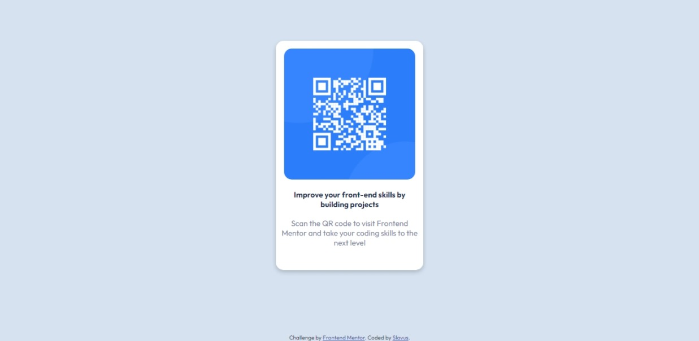

# Frontend Mentor - QR code component solution

This is a solution to the [QR code component challenge on Frontend Mentor](https://www.frontendmentor.io/challenges/qr-code-component-iux_sIO_H). Frontend Mentor challenges help you improve your coding skills by building realistic projects. 

## Table of contents

- [Overview](#overview)
  - [Screenshot](#screenshot)
- [My process](#my-process)
  - [Built with](#built-with)
  - [What I learned](#what-i-learned)
  - [Useful resources](#useful-resources)
- [Author](#author)
- [Acknowledgments](#acknowledgments)

## Overview

### Screenshot




## My process

### Built with

- HTML
- CSS

### What I learned

Use this section to recap over some of your major learnings while working through this project. Writing these out and providing code samples of areas you want to highlight is a great way to reinforce your own knowledge.

To see how you can add code snippets, see below:

```html
  <div class="card">
    <div class="qr-code">
      
    </div>
    <div class="text">
    <p id="suggest">Improve your front-end skills by building projects</p>
    <br>
    <p id="persuade">Scan the QR code to visit Frontend Mentor and take your coding skills to the next level</p>
    </p>      
    </div>
  </div>
  
  <div class="attribution">
    Challenge by <a href="https://www.frontendmentor.io?ref=challenge" target="_blank">Frontend Mentor</a>. 
    Coded by <a href="http://slavuwus.rf.gd/">Slavus</a>.
  </div>
```
```css
:root{
    --White: hsl(0, 0%, 100%);
    --Lightgray: hsl(212, 45%, 89%);
    --Grayishblue: hsl(220, 15%, 55%);
    --Darkblue: hsl(218, 44%, 22%);
}
```

If you want more help with writing markdown, we'd recommend checking out [The Markdown Guide](https://www.markdownguide.org/) to learn more.

### Useful resources

- [Example resource 1](https://www.w3schools.com/) - This helped me for doing CSS

## Author

- Website - [Slavus](http://slavuwus.rf.gd/)
- Frontend Mentor - [@SLAVUSworks](https://www.frontendmentor.io/profile/SLAVUSworks)
- Twitter - [@AghaSlavus](https://twitter.com/AghaSlavus)

## Acknowledgments

This helps me to learning how doing project based by instruction.

